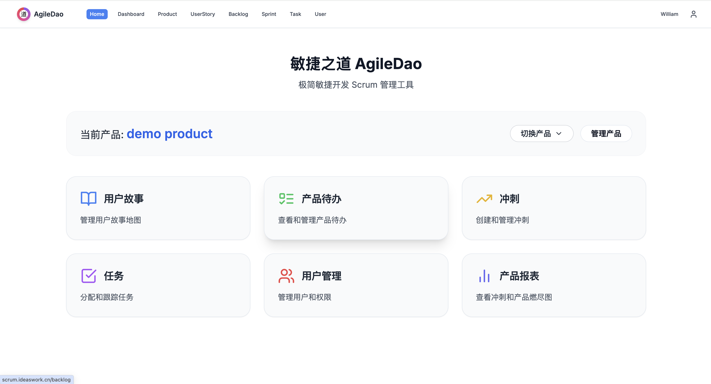
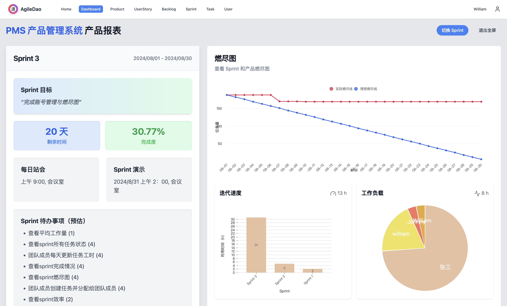
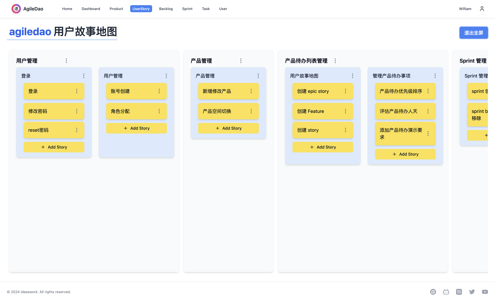
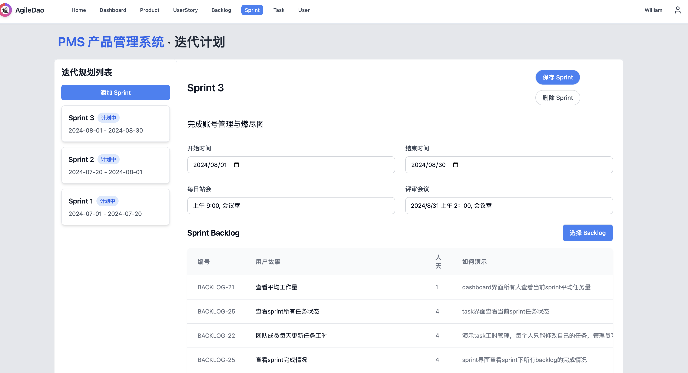
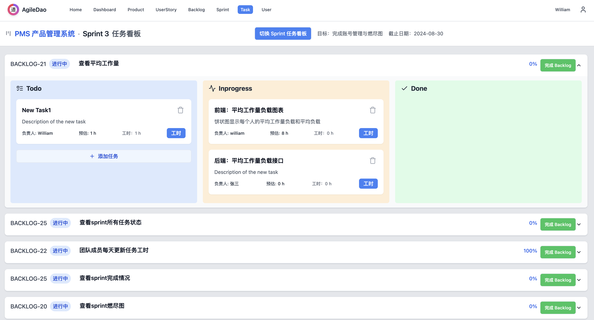

# 【敏捷之道】（AgileDao）

以 pingcode 和禅道为案例分析软件功能，复刻开源的一个极简敏捷开发 scrum 管理软件，适合小型开发团队和独立开发者使用。









## 开始使用

测试地址：[http://scrum.ideaswork.cn/](http://scrum.ideaswork.cn/)
登录账号密码：

- 用户名：123@qq.com
- 密码：123456

项目地址：[https://gitee.com/ideaswork/agiledao](https://gitee.com/ideaswork/agiledao)

### 本项目使用技术：

- next.js 框架
- shadcn UI 框架
- tainwindcss 样式
- @hello-pangea/dnd 拖拽库


### 如何部署

局域网内直接在员工电脑运行即可。

如需公网访问推荐 [腾讯云轻量服务器国外节点}(https://cloud.tencent.com/product/lighthouse)

#### 软件版本：

云服务使用操作系统 ubuntu 24

#### 部署

拷贝 ubuntu-deploy.sh 到服务器直接运行即可，必要时自行修改脚本中的配置

```
sh ubuntu-deploy.sh
```

### 如何开发

环境依赖： nodejs 18、jdk11、mysql

#### 后端开发
首先需要新建数据库并设置后端配置文件的数据库连接。
编辑器运行后在浏览器中打开 [http://localhost:8080/swagger-ui/index.html#/](http://localhost:8080/swagger-ui/index.html#/) 查看接口文档。


### 前端开发

修改前端下的 request.js 中的请求 baseurl 后直接运行
```
npm install
npm run dev

```

在浏览器中打开 [http://localhost:3000](http://localhost:3000) 查看结果。

登录账号密码：

- 用户名：123@qq.com
- 密码：123456


## 其他

本项目永久开源免费，欢迎 star ，求赞助～

打赏二维码：


关于 scrum 知识请查看 [scrum 是什么](./scrum.md)


## 社交媒体

欢迎在以下社交媒体平台上关注我们：

- GitHub: [https://github.com/ideasworkcn/agiledao](https://github.com/ideasworkcn/agiledao)
- Gitee: [https://gitee.com/ideaswork/agiledao](https://gitee.com/ideaswork/agiledao)
- Bilibili: [https://space.bilibili.com/28249524](https://space.bilibili.com/28249524)
- Zhihu: [https://www.zhihu.com/people/wang-qing-gang-41](https://www.zhihu.com/people/wang-qing-gang-41)
- Twitter: [@wqg599252594](https://twitter.com/wqg599252594)
- YouTube: [https://www.youtube.com/channel/UChxgfdsYVrQw-jy1IxWbSNA](https://www.youtube.com/channel/UChxgfdsYVrQw-jy1IxWbSNA)

我们会在这些平台上分享项目更新、Scrum 最佳实践和开发技巧。欢迎与我们互动！

