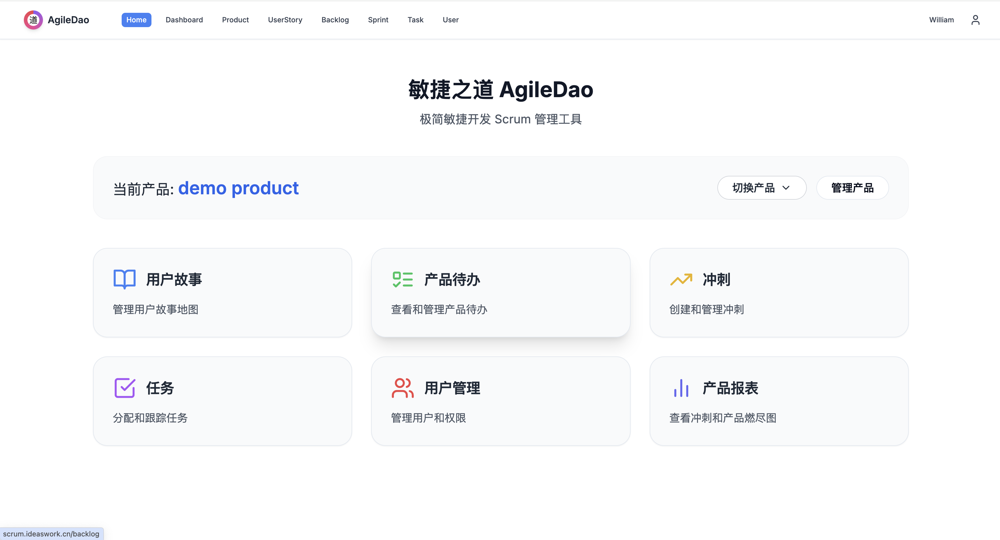
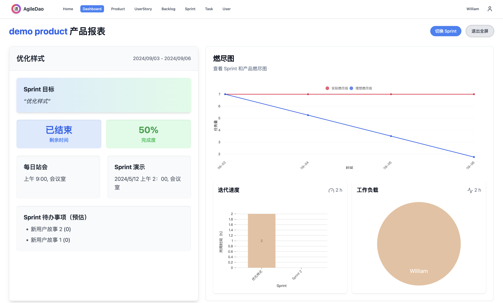
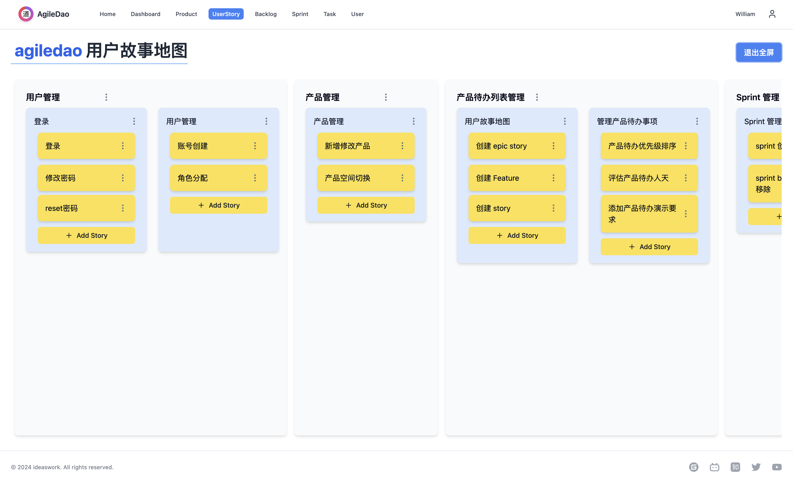
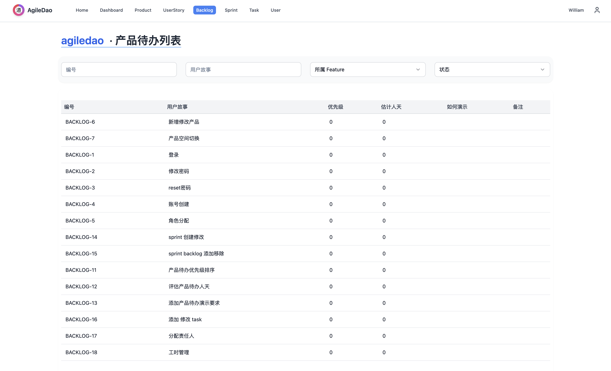
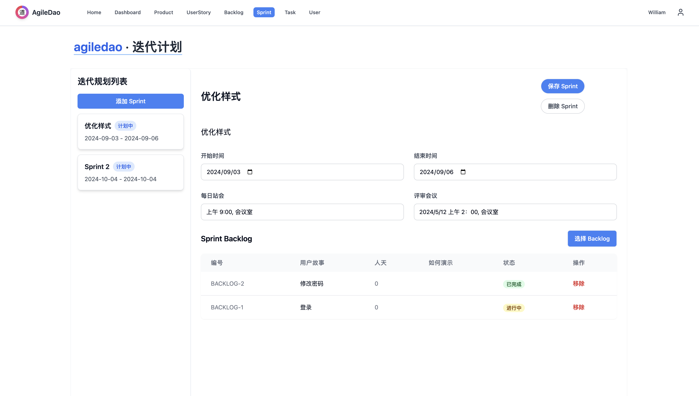
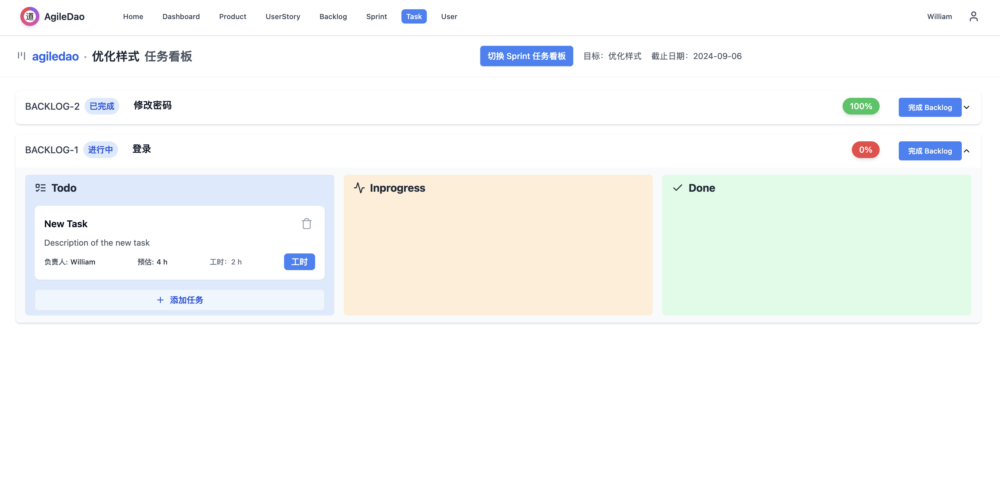

# 【敏捷之道】（AgileDao）

以 pingcode 和禅道为案例分析软件功能，复刻开源的一个极简敏捷开发 scrum 管理软件，适合小型开发团队和独立开发者使用。









## 开始使用

测试地址：[http://scrum.ideaswork.cn/](http://scrum.ideaswork.cn/)
登录 Scrum Master 账号密码：

- 用户名：ideaswork@qq.com
- 密码：ideaswork

项目地址：[https://gitee.com/ideaswork/agiledao](https://gitee.com/ideaswork/agiledao)

### 本项目使用技术：

- Next.js 全栈框架
- React Server Components
- Tailwind CSS 样式
- shadcn UI 组件库
- @hello-pangea/dnd 拖拽库
- Prisma ORM
- Sqlite 本地文件数据库

### 如何本地部署

1. 确保所有员工电脑已安装 Node.js 18 或更高版本
2. 克隆项目到本地：`git clone https://gitee.com/ideaswork/agiledao.git`
3. 安装依赖：`npm install`
4. 运行项目：`npm run dev`
5. 在浏览器中访问：http://localhost:3000

如需指定端口请修改 package.json


#### 如何服务器部署
如需公网访问推荐 [腾讯云轻量服务器国外节点}(https://curl.qcloud.com/zlDFDIiZ)

云服务使用操作系统 ubuntu 24

#### 部署

1. 克隆项目到本地：`git clone https://gitee.com/ideaswork/agiledao.git`
2. 安装依赖：`npm install`
3. 构建项目：`npm run build`
4. 启动项目：`npm run start`
5. 在浏览器中访问：http://服务器公网ip（确保端口已经放开）


### 如何开发

1. **页面路由**：
   - 页面文件放在 `app` 目录下
   - 文件路径即路由路径，例如：
     - `app/page.tsx` -> `/`
     - `app/dashboard/page.tsx` -> `/dashboard`
   - 动态路由使用 `[param]` 语法，例如：
     - `app/projects/[id]/page.tsx` -> `/projects/123`

2. **数据获取**：
   - 使用 Server Components 直接获取数据
   - 示例：
     ```typescript
     async function getData() {
       const res = await fetch('https://api.example.com/data')
       return res.json()
     }
     
     export default async function Page() {
       const data = await getData()
       return <div>{data}</div>
     }
     ```

3. **API 路由**：
   - API 路由放在 `app/api` 目录下
   - 示例：
     ```typescript
     // app/api/hello/route.ts
     export async function GET() {
       return Response.json({ message: 'Hello World' })
     }
     ```

     ```

4. **Prisma 使用**：
   - 定义模型在 `prisma/schema.prisma`
   - 生成客户端：`npx prisma generate`
   - 迁移数据库：`npx prisma migrate dev`


## 其他

本项目永久开源免费，欢迎 star ，求赞助～

打赏二维码：
<div style="display: flex; gap: 20px;">
  
  
</div>


关于 scrum 知识请查看 [scrum 是什么](./scrum.md)


## 社交媒体

欢迎在以下社交媒体平台上关注我们：

- GitHub: [https://github.com/ideasworkcn/agiledao](https://github.com/ideasworkcn/agiledao)
- Gitee: [https://gitee.com/ideaswork/agiledao](https://gitee.com/ideaswork/agiledao)
- Bilibili: [https://space.bilibili.com/28249524](https://space.bilibili.com/28249524)
- Zhihu: [https://www.zhihu.com/people/wang-qing-gang-41](https://www.zhihu.com/people/wang-qing-gang-41)
- Twitter: [@wqg599252594](https://twitter.com/wqg599252594)
- YouTube: [https://www.youtube.com/channel/UChxgfdsYVrQw-jy1IxWbSNA](https://www.youtube.com/channel/UChxgfdsYVrQw-jy1IxWbSNA)

我们会在这些平台上分享项目更新、Scrum 最佳实践和开发技巧。欢迎与我们互动！

